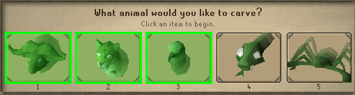

# Vale Totems Plugin

A RuneLite plugin that enhances the Vale Totems minigame experience in Varlamore by providing helpful overlays and tracking features.

## Features

### Totem Site Tracking
- Displays status of all 8 totem sites in a convenient overlay
- Shows current points at each site
- Indicates which sites are ready to build, active, or have claimable points
- Tracks total points across all sites

Example: 

### Animal Spirit Assistance
- **Smart Dialog Highlighting**: Automatically highlights the correct animal spirits in the carving dialog
- **Carved Animal Tracking**: Tracks which animals you've already carved and removes their highlight
- **Animal Popup Display**: Optional popup showing all correct animals with their IDs
- **Automatic Detection**: Detects which totem you're working on based on your location

Example:

### Ent Trail Detection
- Highlights Ent Trail ground objects in green
- Helps track Ent movement patterns
- Dynamically updates as new trails appear

### Debug Mode
- Detailed logging for troubleshooting / development
- Widget inspection for development
- Ground object detection for finding new Ent Trail IDs

## Installation

1. Open RuneLite
2. Navigate to the Plugin Hub
3. Search for "Vale Totems"
4. Click Install

## Configuration

Access the plugin settings through the RuneLite configuration panel:

| Setting | Default | Description                                        |
|---------|---------|----------------------------------------------------|
| **Show Site Tooltips** | ❌ Off | Displays the totem site status overlay             |
| **Highlight Dialog Options** | ✅ On | Highlights correct animals in the carving dialog   |
| **Show Animal Popup** | ❌ Off | Shows a separate popup with correct animal numbers |
| **Highlight Ent Trails** | ❌ Off | Highlights Ent Trail ground objects (WIP)          |
| **Debug Mode** | ❌ Off | Enables detailed logging for troubleshooting       |

## How to Use

### Building Totems

**Approach a totem site** - The plugin will automatically detect which site you're at

**Start building** - Click "Build" on an empty totem pole

### Carving Animals
**Start carving** - The plugin remembers the correct animals

**Use the dialog** - Correct animals are highlighted in green

**Track progress** - Carved animals lose their highlight and appear gray in the popup

### Following Ent Trails

**Enable trail highlighting** - Ent Trails appear with green overlay (Currently Broken)
**Follow the paths** - Trails show where Ents have recently walked
**Find active Ents** - Fresh trails lead to Ents you can chop

## Tips

- 📍 You must be within 10 tiles of a totem for the plugin to track it
- 🌿 Ent Trails spawn dynamically - they appear as Ents move around

## Troubleshooting

### Animals not highlighting?
- Make sure you've talked to the foresters first
- Verify you're at a totem site (within 10 tiles)
- Check that "Highlight Dialog Options" is enabled

### Wrong totem site detected?
- The plugin uses your proximity to determine the site
- Move closer to the totem you want to work on
- Enable debug mode to see distance calculations

### Ent Trails not showing?
- Verify "Highlight Ent Trails" is enabled
- Trails only appear where Ents have recently walked
- Some areas may not have active Ents

## Technical Details

### Varbit Tracking
The plugin tracks totem states using game varbits:
- Points per site
- Decay timers
- Base carved status
- Animal assignments

### Known Ent Trail IDs
- 55115
- 55116

If you discover additional Ent Trail IDs, please report them!

## Contributing

Found a bug or have a suggestion? Please create an issue on the GitHub repository.

## Credits

- **Author**: StolenAxe
- **Plugin Name**: Vale Totems
- **Tags**: varlamore, fletching, minigame, vale, totem

## License

This plugin is released under the BSD 2-Clause License.